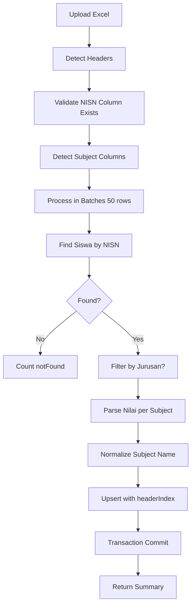
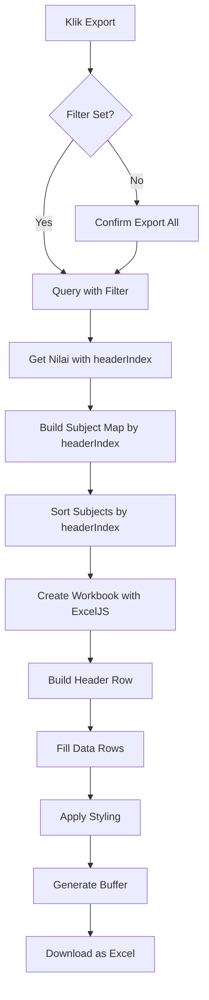

# 📊 Import/Export Nilai Rapor - User Guide

## 🎯 Overview
Sistem import/export nilai rapor dengan **intelligent header detection** dan **exact match export** untuk kompatibilitas PDSS/PTKIN.

### ✨ Key Features
- **Auto Header Detection**: Deteksi kolom NISN, Semester, dan Mata Pelajaran secara otomatis
- **Subject Normalization**: Mapping nama mata pelajaran dari berbagai format (PDSS, PTKIN, e-Rapor)
- **headerIndex Tracking**: Menyimpan posisi kolom asli untuk export exact match
- **Batch Processing**: Proses 700+ siswa dengan transaction safety
- **Filter by Jurusan/Semester**: Import/export data spesifik
- **Professional Excel Output**: Styling dengan frozen headers, auto-width, KKM highlighting

---

## 📥 **IMPORT NILAI**

### Akses Menu
1. Login sebagai **Admin**
2. Navigate: **Dashboard** → **Data Nilai**
3. Klik tab **Import Nilai**

### Format Excel yang Didukung

#### Minimal Required Columns:
```
NISN | [Mata Pelajaran 1] | [Mata Pelajaran 2] | ...
```

#### Contoh Format Lengkap:
```
NISN       | Nama        | Kelas | Jurusan | Matematika | Bahasa Indonesia | Fisika | ...
0012345678 | Ahmad       | XII-1 | IPA     | 85         | 90               | 88     | ...
0087654321 | Siti        | XII-2 | IPA     | 92         | 88               | 91     | ...
```

### Header Patterns yang Dikenali

| Type | Accepted Patterns |
|------|-------------------|
| **NISN** | `nisn`, `nis`, `nomor induk` |
| **Semester** | `semester`, `sem`, `smt` |
| **Nama** | `nama`, `name`, `siswa`, `student` |
| **Jurusan** | `jurusan`, `program`, `kompetensi`, `keahlian` |

### Subject Normalization Examples

| Excel Header | Normalized |
|--------------|-----------|
| `pai`, `Pendidikan Agama` | Pendidikan Agama dan Budi Pekerti |
| `pkn`, `ppkn` | Pendidikan Pancasila dan Kewarganegaraan |
| `mtk`, `Matematika` | Matematika |
| `b. indonesia`, `BIND` | Bahasa Indonesia |
| `b. inggris`, `BING`, `English` | Bahasa Inggris |
| `pjok`, `Penjas` | PJOK |

### Import Steps

1. **Upload File**
   - Klik area upload atau drag-and-drop Excel file
   - Format: `.xlsx` atau `.xls`

2. **Set Filters (Optional)**
   - **Jurusan**: Hanya import untuk jurusan tertentu
   - **Semester**: Specify semester (jika tidak ada di Excel)

3. **Klik "MULAI INTEGRASI"**
   - Sistem akan:
     - Detect headers automatically
     - Normalize subject names
     - Match NISN dengan database siswa
     - Save headerIndex untuk export
     - Upsert nilai (update jika ada, create jika baru)

4. **Review Results**
   - **Total Rows**: Jumlah baris data
   - **Berhasil**: Nilai yang berhasil diproses
   - **Created**: Nilai baru yang ditambahkan
   - **Updated**: Nilai yang diupdate
   - **NISN Tidak Ditemukan**: NISN yang tidak ada di database
   - **Errors**: Error details (max 50 ditampilkan)
   - **Mata Pelajaran Terdeteksi**: List subjects dengan column number

### Import Logic Flow



### Important Notes
- ⚠️ **NISN column is REQUIRED** - Import will fail if not detected
- 💡 **Semester**: Can be in Excel or set via form (form value takes priority)
- 🔄 **Upsert Logic**: Existing nilai will be updated, isVerified reset to false
- 🎯 **headerIndex**: Saved automatically untuk exact export match
- ⚡ **Performance**: Processes in batches of 50 rows with transaction safety

---

## 📤 **EXPORT NILAI**

### Akses Menu
1. Login sebagai **Admin**
2. Navigate: **Dashboard** → **Data Nilai**
3. Set filters (optional)
4. Klik **"Export Excel"** button (green button di header)

### Export Features

#### 1. **Exact Column Match**
- Menggunakan `headerIndex` dari import
- Column order **EXACTLY** sama dengan Excel asli
- Cocok untuk upload ke PDSS/PTKIN

#### 2. **Professional Styling**
- **Header**: Blue background, white text, bold
- **Borders**: All cells bordered
- **Frozen Header**: Header row frozen untuk scrolling
- **Auto-width**: Column width adjusted otomatis
- **NISN as Text**: Prefix `'` untuk prevent scientific notation
- **KKM Highlighting**: Nilai < 75 ditampilkan merah

#### 3. **Filter Options**
- **By Jurusan**: Export hanya siswa dari jurusan tertentu
- **By Semester**: Export hanya nilai semester tertentu
- **All Data**: Kosongkan filter untuk export semua

### Export Structure

```
NISN      | Nama  | Kelas | Jurusan | [Subjects in ORIGINAL column order] |
'00012345 | Ahmad | XII-1 | IPA     | 85 | 90 | 78 | 92 | ...              |
'00087654 | Siti  | XII-2 | IPA     | 92 | 88 | 91 | 89 | ...              |
```

### Export Steps

1. **Set Filters (Optional)**
   - Pilih **Jurusan** (atau biarkan "Semua Jurusan")
   - Pilih **Semester** (atau biarkan "Semua Semester")

2. **Klik "Export Excel"**
   - Jika tidak ada filter: Konfirmasi export semua data
   - Sistem akan generate Excel dengan headerIndex ordering

3. **Download Automatic**
   - File: `Nilai_Export_YYYY-MM-DD.xlsx`
   - Ready untuk upload ke PDSS/PTKIN

### Export Logic Flow



### NISN Format Handling

**Problem**: Excel converts NISN ke scientific notation
```
0012345678 → 1.23457E+09
```

**Solution**: Prefix dengan `'` (single quote)
```
'0012345678 → Text format, preserved as-is
```

---

## 🔄 **SANGGAHAN WORKFLOW**

### Student Side

1. **View Nilai**: `/siswa/verifikasi-nilai`
2. **Klik "Sanggah"** untuk nilai yang salah
3. **Fill Form**:
   - Nilai Baru (yang benar)
   - Upload Bukti Rapor (foto/scan)
   - Keterangan (alasan)
4. **Submit** → Status: `pending`

### Admin Side

1. **Access**: `/admin/sanggahan`
2. **View List** dengan filter:
   - All
   - Pending
   - Approved
   - Rejected
3. **Review Detail**:
   - Info siswa
   - Nilai lama vs baru
   - Bukti rapor
   - Alasan
4. **Action**:
   - **Setuju**: Updates nilai + sets isVerified = true (atomic transaction)
   - **Tolak**: Input alasan penolakan

### Sanggahan API Flow (Atomic)

```javascript
// When APPROVED - ALL in ONE transaction:
prisma.$transaction([
  // 1. Update sanggahan status
  tx.sanggahan.update({ status: 'approved' }),
  
  // 2. Update nilai rapor
  tx.nilaiRapor.updateMany({ 
    nilai: nilaiBaru,
    isVerified: true 
  }),
  
  // 3. Create audit log
  tx.auditLog.create({ ... })
])
// If ANY step fails → AUTOMATIC ROLLBACK
```

---

## 📋 **DATABASE SCHEMA**

### NilaiRapor Model
```prisma
model NilaiRapor {
  id             String   @id @default(cuid())
  siswaId        String
  semester       Int
  mataPelajaran  String
  nilai          Float
  isVerified     Boolean  @default(false)
  headerIndex    Int?     // 🆕 Excel column position for exact export
  createdAt      DateTime @default(now())
  updatedAt      DateTime @updatedAt
  
  siswa          Siswa    @relation(...)
  
  @@unique([siswaId, semester, mataPelajaran])
  @@index([isVerified])
}
```

### Sanggahan Model
```prisma
model Sanggahan {
  id            String   @id @default(cuid())
  siswaId       String
  nilaiId       String?  // 🆕 Reference to NilaiRapor
  semester      Int
  mataPelajaran String
  nilaiLama     Float
  nilaiBaru     Float
  alasan        String   @db.Text // 🆕 Alasan sanggahan
  buktiRapor    String?  // Nullable
  status        String   @default("pending")
  createdAt     DateTime @default(now())
  updatedAt     DateTime @updatedAt
  
  siswa         Siswa    @relation(...)
  
  @@index([semester])
}
```

---

## 🚀 **API Endpoints**

### Import API
```
POST /api/admin/nilai/import
```

**Request (FormData)**:
```javascript
{
  file: File,           // Excel file (.xlsx/.xls)
  jurusanId?: string,   // Optional filter
  semester?: string     // Optional (overrides Excel value)
}
```

**Response**:
```json
{
  "success": true,
  "data": {
    "summary": {
      "totalRows": 150,
      "processedNISN": 145,
      "successCount": 1450,
      "createdCount": 800,
      "updatedCount": 650,
      "notFoundCount": 5,
      "errorCount": 2
    },
    "detection": {
      "headers": [
        { "column": 1, "name": "NISN" },
        { "column": 2, "name": "Nama" },
        { "column": 5, "name": "Matematika" }
      ],
      "subjects": [
        { "column": 5, "name": "Matematika" },
        { "column": 6, "name": "Bahasa Indonesia" }
      ],
      "coreColumns": {
        "nisn": 1,
        "semester": 3,
        "nama": 2,
        "jurusan": 4
      }
    },
    "errors": ["Baris 10: NISN tidak ditemukan", ...]
  }
}
```

### Export API
```
POST /api/admin/nilai/export-excel
```

**Request (JSON)**:
```json
{
  "jurusanId": "optional-uuid",
  "semester": "1-6 (optional)"
}
```

**Response**: Excel file download

---

## 📊 **Subject Mapping Database**

Untuk mapping custom, gunakan tabel `MapelMapping`:

```sql
-- Example: Map "MTK" from Excel to "Matematika" in system
INSERT INTO MapelMapping (mataPelajaranSistem, mataPelajaranEksternal, isActive)
VALUES ('Matematika', 'MTK', true);
```

Akses: `/admin/konfigurasi` → **Mapping Mata Pelajaran**

---

## 🔧 **Troubleshooting**

### Import Issues

**❌ "Kolom NISN tidak ditemukan"**
- ✅ Solution: Pastikan ada kolom dengan header `NISN`, `NIS`, atau `Nomor Induk`

**❌ "Tidak ada kolom mata pelajaran"**
- ✅ Solution: Pastikan ada minimal 1 kolom selain NISN/Nama/Kelas/Jurusan

**❌ "NISN tidak ditemukan di database"**
- ✅ Solution: Import data siswa dulu via `/admin/siswa/import`

**❌ "Semester tidak terdeteksi"**
- ✅ Solution: Set semester via dropdown form atau tambahkan kolom Semester di Excel

### Export Issues

**❌ "Tidak ada data siswa"**
- ✅ Solution: Pastikan sudah ada data nilai yang diimport dengan headerIndex

**❌ "NISN berubah jadi scientific notation"**
- ✅ Solution: System auto-prefix dengan `'` - jangan dihapus saat edit Excel

**❌ "Column order tidak sesuai"**
- ✅ Solution: Hanya nilai yang diimport dengan headerIndex yang di-export. Re-import jika perlu.

---

## 🎓 **Best Practices**

### Import
1. ✅ **Backup database** sebelum import besar
2. ✅ **Test dengan 5-10 baris** dulu
3. ✅ **Review error messages** setelah import
4. ✅ **Verify sample data** di `/admin/siswa`
5. ✅ **Re-import** jika ada perubahan column order

### Export
1. ✅ **Set filter** untuk export spesifik
2. ✅ **Check NISN format** sebelum upload ke PDSS/PTKIN
3. ✅ **Don't modify column order** di exported Excel
4. ✅ **Save original** untuk reference

### Sanggahan
1. ✅ **Review bukti rapor** before approving
2. ✅ **Double check nilai** sebelum approve
3. ✅ **Provide clear rejection reason**

---

## 📞 **Support**

**Developer**: System Integration Team
**Email**: admin@si-eligible.school.id
**Documentation**: `/IMPORT_EXPORT_NILAI_GUIDE.md`

---

**Last Updated**: 2 Januari 2026  
**Version**: 2.0 (Intelligent Import with headerIndex Tracking)
